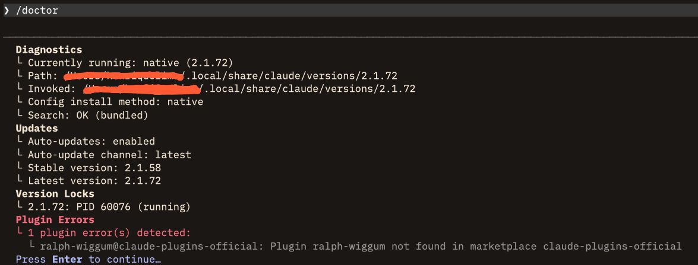

<div align="center">

# harness-lab

[](https://nodejs.org/)
[](https://developer.mozilla.org/en-US/docs/Web/JavaScript)
[](https://github.com/hgflima/harness-lab)
[](https://opensource.org/licenses/MIT)
[](https://claude.com/claude-code)

**Curated public registry of AI agent harnesses for Claude Code**

[Install](#getting-started) · [Report Bug](https://github.com/hgflima/harness-lab/issues) · [Request Feature](https://github.com/hgflima/harness-lab/issues)

</div>

## About

harness-lab is a curated public registry of AI agent harnesses (skills, commands, agents, hooks) for Claude Code. It includes a zero-dependency Node.js CLI for browsing, installing, and managing harnesses from GitHub directly into `.claude/` directories.

- Browse harnesses by category (Product, Software Engineering, Design, Harness Engineering)
- Install skills, commands, agents, and hooks with a single command
- Three installation scopes: global, project, or local
- Always fetches the latest versions from GitHub — no local cache

## Why not plugins?

Claude Code has a native plugin system — so why does harness-lab distribute artifacts as standalone `.claude/` files instead?

**Practical install/uninstall workflow.** The CLI lets you browse, install, and remove artifacts from any terminal in seconds (`harness-lab install ...` / `harness-lab uninstall ...`). The `init` command bootstraps slash commands so you can also manage everything from inside Claude Code (`/harness-lab:install`). No marketplace setup, no manifest files — just files copied in and out of `.claude/`.

**Granularity and cohesion.** Harnesses tend to have higher granularity and cohesion than plugins. Each harness groups artifacts around a single, well-defined purpose (e.g. PRD generation), while plugins tend to bundle loosely related capabilities together. This matters because tighter cohesion means less irrelevant context loaded per task — and with harness-lab, each artifact is an independent file you can install or remove individually.

**Persistent ghost errors.** Plugins can leave behind errors that are difficult to trace and persist even after the plugin is uninstalled or disabled. The screenshot below shows a `/doctor` output reporting "Plugin ralph-wiggum not found in marketplace" — an error that lingers with no clear way to resolve it. File-based artifacts don't have this problem: uninstalling simply deletes the files, leaving no residual state.



Plugins are great for MCP integrations, LSP servers, and hook-heavy workflows. But for a curated registry of prompt-based artifacts, the file-based approach is simpler and more efficient.

### Available Harnesses

| Harness | Description | Author |
|---------|-------------|--------|
| **prd-generator** | Context engineering PRD generator for AI-driven software development | hgflima |
| **agent-md-writer** | Generate and maintain high-quality CLAUDE.md and AGENT.md files | hgflima |
| **rules-generator** | Analyze a project's stack and generate tailored .claude/rules/ files | hgflima |
| **github-readme-writer** | Generate comprehensive, professional README.md files for any project | alfredang |
| **product-vision-frame** | Define a product's singular purpose and ruthlessly align all decisions to that vision | hgflima |
| **customer-journey-to-be** | Generate to-be customer journey maps with phases, happy paths, exception flows, and Mermaid diagrams | hgflima |
| **lessons-learned** | Post-incident analysis and correction for Claude Code sessions — diagnoses root causes, applies fixes, and persists structured changelogs | hgflima |
| **product-brief** | Interactive wizard for creating structured product briefs across project levels (spike, POC, MVP, feature, product, platform) | hgflima |

## Tech Stack

| Category | Technology |
|----------|------------|
| Language | JavaScript (ESM) |
| Runtime | Node.js >= 18 |
| Dependencies | Zero — Node.js built-ins only |
| Data Source | GitHub Raw + GitHub REST API |
| Distribution | npm / npx |

## Architecture

```
┌─────────────────────────────────────────────────┐
│                   User Layer                    │
│                                                 │
│   npx harness-lab          /harness-lab:install │
│   (Terminal CLI)           (Slash Commands)     │
└────────────┬──────────────────────┬─────────────┘
             │                      │
             ▼                      ▼
┌───────────────────────────────────────────────────┐
│                 CLI Layer (src/cli/)              │
│                                                   │
│   categories · list · install · uninstall · update│
└────────────────────────┬──────────────────────────┘
                         │
                         ▼
┌──────────────────────────────────────────────────┐
│               Core Layer (src/core/)             │
│                                                  │
│   catalog.js     installer.js     scope.js       │
│   (fetch index)  (download/remove) (resolve path)│
└────────────────────────┬─────────────────────────┘
                         │
                         ▼
┌───────────────────────────────────────────────────┐
│              GitHub (Remote Data)                 │
│                                                   │
│   raw.githubusercontent.com   api.github.com      │
│   (catalog.json, artifacts)   (directory listings)│
└───────────────────────────────────────────────────┘
```

## Project Structure

```
harness-lab/
├── bin/cli.js                  — CLI entry point (shebang, command router)
├── src/
│   ├── core/                   — Business logic (shared by CLI + slash commands)
│   │   ├── catalog.js          — Fetch catalog.json and harness.json from GitHub
│   │   ├── installer.js        — Download artifacts to .claude/, remove on uninstall
│   │   └── scope.js            — Resolve target path (global/project/local)
│   ├── cli/                    — Command handlers (parse args, call core, format output)
│   │   ├── categories.js, list.js, install.js, uninstall.js, update.js
│   └── setup/
│       └── init.js             — npx bootstrap (npm install -g + copy slash commands)
├── templates/slash-commands/
│   └── harness-lab/            — 5 .md files → .claude/commands/harness-lab/
├── harnesses/                  — The curated harness collection
│   └── <name>/
│       ├── harness.json        — Metadata: name, version, categories, artifact list
│       ├── skills/             — Skill files (SKILL.md, prompt.md, references/, scripts/)
│       ├── commands/           — Slash command files (<name>.md)
│       ├── agents/             — Subagent files (<name>.md)
│       ├── rules/              — Rule files (<name>.md)
│       └── hooks/              — Hook scripts and config
├── catalog.json                — Registry index (categories + harness entries)
└── package.json
```

## Getting Started

### Prerequisites

- [Node.js](https://nodejs.org/) >= 18.0.0

### Install

```bash
npm install -g harness-lab@1.0.0
```

Then install the slash commands for Claude Code:

```bash
harness-lab init
```

The `init` wizard asks where to place the slash commands (global, project, or local) and copies them into your `.claude/commands/` directory.

### CLI Commands

```bash
harness-lab                          # Run init (install slash commands)
harness-lab categories               # List available categories
harness-lab list [category]          # List harnesses, optionally by category
harness-lab install <name>           # Install a harness (default scope: project)
harness-lab uninstall <name>         # Uninstall a harness
harness-lab update [name]            # Update one or all harnesses
harness-lab --version                # Show version
harness-lab --help                   # Show help
```

Use `--scope` to control where artifacts are installed:

```bash
harness-lab install prd-generator --scope global    # ~/.claude/
harness-lab install prd-generator --scope project   # .claude/ (default)
harness-lab install prd-generator --scope local     # .claude/local/
```

### Slash Commands

After running `harness-lab init`, these commands are available inside Claude Code:

```
/harness-lab:categories     List available categories
/harness-lab:list           List harnesses
/harness-lab:install        Install a harness
/harness-lab:uninstall      Uninstall a harness
/harness-lab:update         Update harnesses
```

### Alternative: Run with npx

If you prefer not to install globally, use `npx` to run any command directly:

```bash
# Install globally + slash commands
npx harness-lab@1.0.0

# Browse and install
npx harness-lab@1.0.0 categories
npx harness-lab@1.0.0 list software-engineering
npx harness-lab@1.0.0 install prd-generator --scope project
npx harness-lab@1.0.0 uninstall prd-generator
npx harness-lab@1.0.0 update
```

## Contributing

1. Fork the repository
2. Create your feature branch (`git checkout -b feat/my-feature`)
3. Commit your changes (`git commit -m 'Add my feature'`)
4. Push to the branch (`git push origin feat/my-feature`)
5. Open a Pull Request

For questions and discussions, visit [GitHub Issues](https://github.com/hgflima/harness-lab/issues).

## Developed By

[hgflima](https://github.com/hgflima)

## Acknowledgements

- [Anthropic](https://www.anthropic.com/) for Claude Code
- [alfredang](https://github.com/alfredang) for the github-readme-writer harness
- [sethmblack](https://github.com/sethmblack) for the product-vision-frame harness
- All contributors who submit harnesses to the registry

---

<div align="center">

If you find this useful, please give it a star!

</div>
